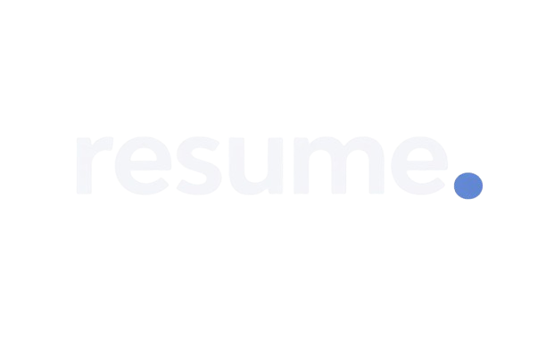
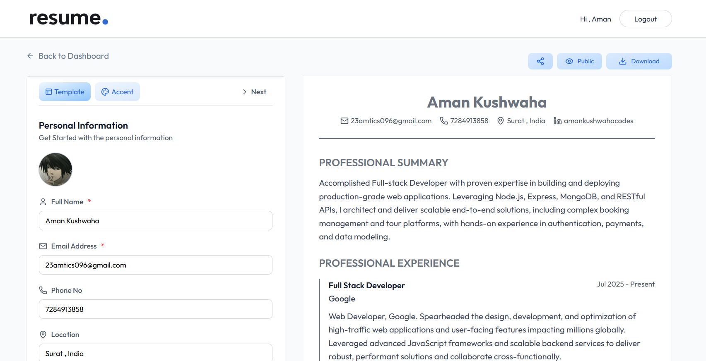

  

  <h1>AI Resume Builder</h1>

  <h3>
    <a href="https://airesumebuilderapp.vercel.app//">
      <strong>Live Site</strong>
    </a>
  </h3>

  

        <a href="https://airesumebuilderapp.vercel.app/">View website</a>
        •
        <a href="https://github.com/amankushwahacodes/resumebuilder/issues">Report Bug</a>
        •
        <a href="https://github.com/amankushwahacodes/resumebuilder/pulls">Request Feature</a>
  

  

<!-- Badges -->

<!-- Brief -->

<b>AI Resume Builder</b> is a full-stack web application that helps users create, edit, and manage professional resumes with AI-assisted content generation.
It provides secure authentication, resume customization, live preview, and seamless deployment for real-world usage.

<!-- Screenshot -->
<a align="center" href="https://airesumebuilderapp.vercel.app/">

;

</a>

## Resume Managment and Builder
- Create, edit, and delete multiple resumes from a single dashboard
- AI-assisted content generation for resume sections
- Live resume preview for real-time updates and validation

## Authentication & User Management
- Secure JWT-based authentication ensures only registered users can access the platform
- Users can manage their accounts, including profile details and session persistence
- Protected routes prevent unauthorized access to resume data

## Application Flow & Experience
- Centralized dashboard for managing all user resumes
- Smooth navigation with client-side routing and guarded routes
- Responsive design optimized for desktop and mobile devices

## Core Features

- **Resume Management**
  - Create, edit, and delete multiple resumes with structured sections

- **AI-Assisted Content Generation**
  - Generate and enhance resume content using AI for better clarity and impact

- **Live Preview**
  - View resume changes in real time while editing

- **Authentication & Protected Access**
  - Secure login system with protected routes to ensure user data privacy

- **Responsive Design**
  - Fully supported dark mode for improved usability and accessibility

## Tech Stack

- **Frontend:** 
  - **Framework & UI:** React, React Router, Tailwind CSS
  - **State Management:** Redux Toolkit
  - **Build tool:** Vite
- **Backend**
  - **Runtime & Framework:** Supabase (Database, Authentication, Real-time)
  - **Database:** MongoDB (Atlas)
  - **Authentication:** JWT-based authentication
  - **AI Integration:** OpenAI API
- **Deployment**
  - **Frontend Hosting:** Vercel
  - **Backend Hosting:** Render

## Engineering Highlights

- Implemented secure JWT-based authentication with protected routes and persistent sessions
- Designed and structured a scalable MERN-based client–server architecture
- Integrated AI-powered resume content generation into the resume creation workflow
- Configured production-ready CORS and environment-specific settings for cross-origin communication
- Deployed and optimized a single-page application with proper routing and refresh handling

## Author

<b>👤 Aman Kushwaha</b>

- LinkedIn - [@amankushwahacodes](https://www.linkedin.com/in/amankushwahacodes)
- GitHub - [@amankushwahacodes](https://github.com/amankushwahacodes)

Feel free to contact me with any questions or feedback!
